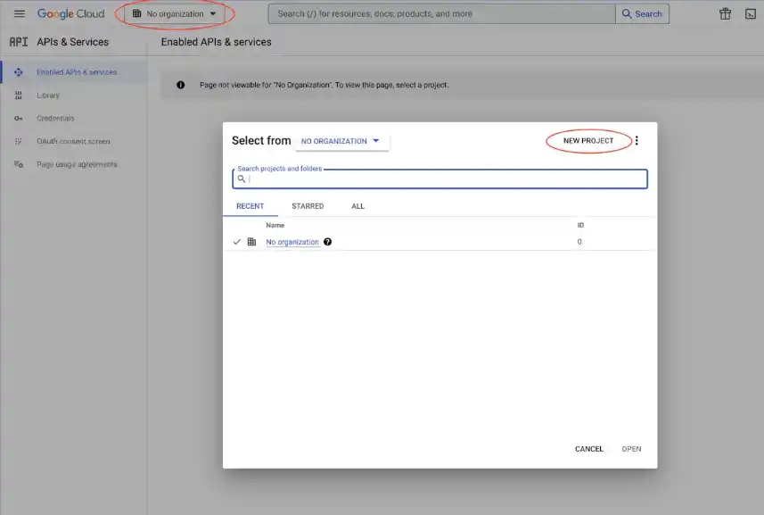
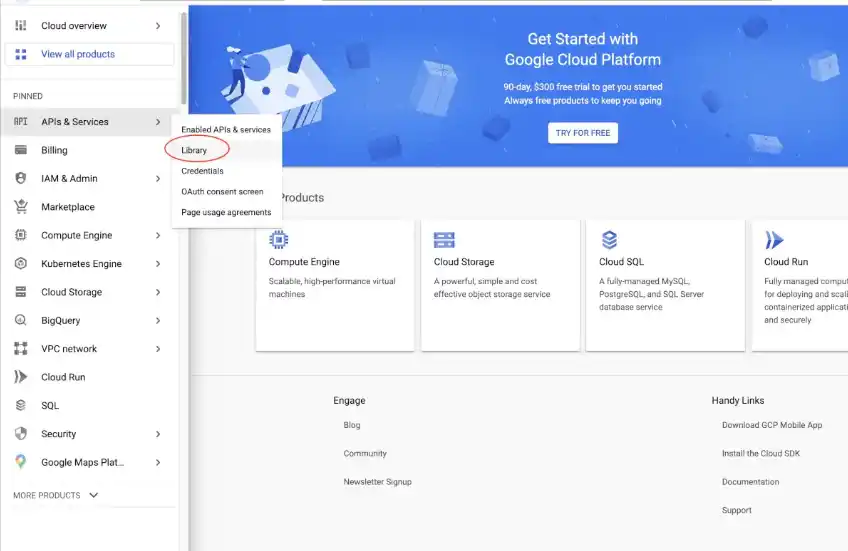
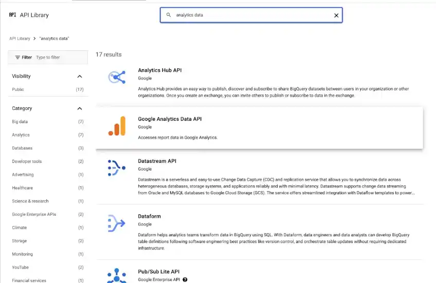
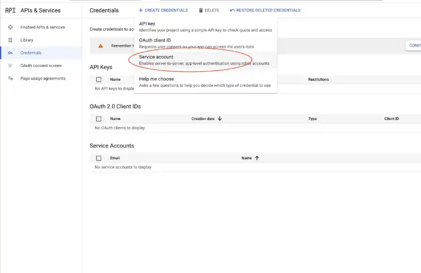
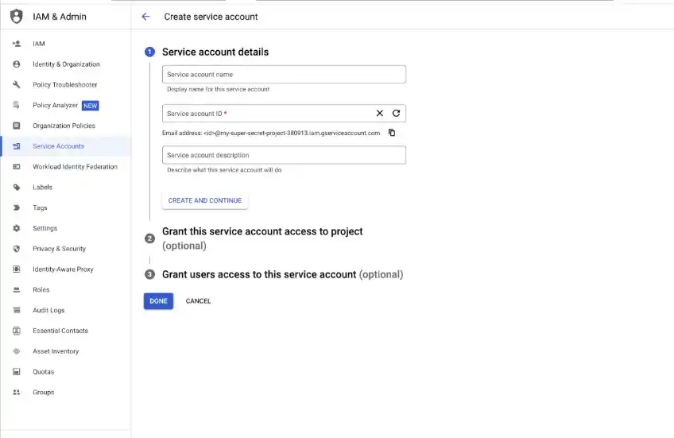
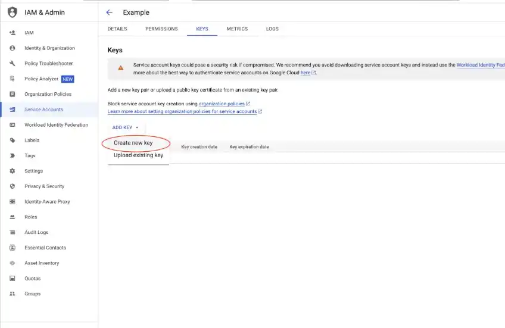
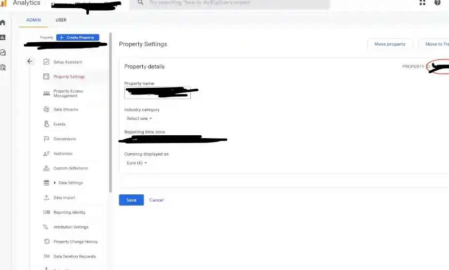
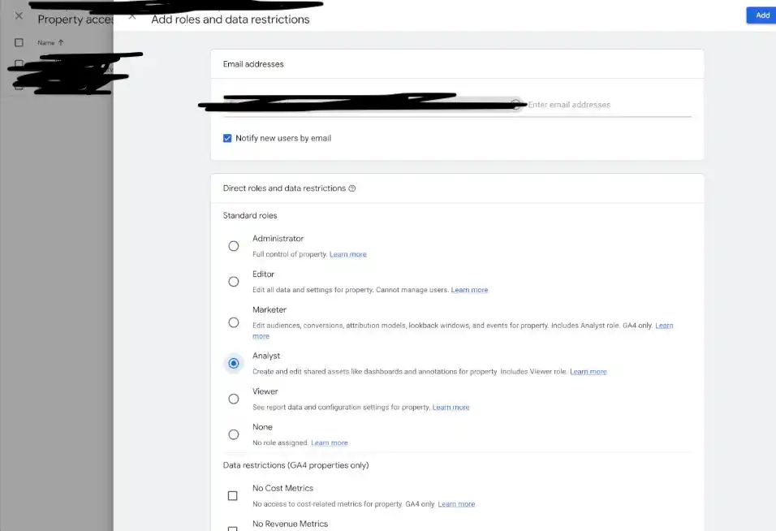

# Google Analytics (GA4) Credentials Setup Guide

## 1. How to obtain the credentials to communicate with Google Analytics

### Getting credentials

The first thing you’ll need to do is get credentials to use Google APIs. Head over to Google APIs / Google Cloud Console and select or create a project.



Next, specify which APIs the project may consume. Go to the API Library and search for **Google Analytics Data API**.




Choose **Enable** to enable the API.



Now that you’ve created a project with access to the Analytics API, download a file with the credentials. Click **Credentials** in the sidebar and create a **Service account key**.



On the next screen you can give the service account a name. In the service account ID you’ll see an email address. You’ll use this email address later in the guide.



Go to the details screen of your created service account and select **Keys**. From **Add key**, select **Create new key**.


Select **JSON** as the key type and click **Create** to download the JSON file.



**Important:** Download the JSON file and **do not commit it to git**.

Place the file inside Laravel storage, for example:

```text
storage/app/private/analytics/service-account-credentials.json
```

Also add this to `.gitignore`:

```gitignore
/storage/app/private/analytics/*.json
```

Save the JSON inside your Laravel project at the location specified in the `service_account_credentials_json` key of the config file. Because the JSON file contains potentially sensitive information, do not commit it to your repository.

<br>
<br>

## 2. Grant permissions to your Analytics property

This guide assumes you already created a Google Analytics account and are using the new GA4 properties.

First, find your property ID. In Analytics, go to **Settings > Property Settings**. Copy the property ID and use it for the `ANALYTICS_PROPERTY_ID` key in your `.env` file.



Now give access to the service account you created. Go to **Property Access Management** in the Admin section of the property. Click the plus sign in the top right corner to add a new user.

On that screen, grant access to the email address found in the `client_email` key from the JSON file you downloaded in the previous step. **Analyst** role is enough.




----
If Analytics GUI fails to add client_email, do the following
The Success Path (OAuth2 Playground)
Authorization (Step 1):

In the OAuth2 Playground, input this custom scope:
https://www.googleapis.com/auth/analytics.manage.users

Click Authorize APIs and log in as the GA4 Admin.

Tokens (Step 2):

Click Exchange authorization code for tokens.

The Request (Step 3):

HTTP Method: POST

Request URI: https://analyticsadmin.googleapis.com/v1alpha/properties/[YOUR_PROPERTY_ID]/accessBindings

JSON Body: ```json
{
"user": "....gserviceaccount.com",
"roles": ["predefinedRoles/editor"]
}

Note: Use "user", not "emailAddress".